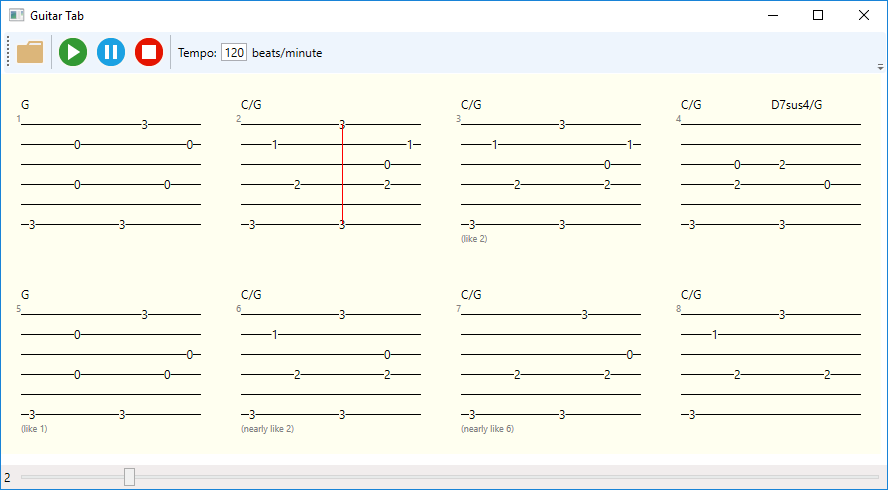

# Guitab

This program displays a [Guitar tablature](https://en.wikipedia.org/wiki/Tablature).

I wrote it for personal use: and to get acquainted with [WPF](https://en.wikipedia.org/wiki/Windows_Presentation_Foundation)
(I already knew [Windows Forms](https://en.wikipedia.org/wiki/Windows_Forms)).

---

The program takes an input file with a format like this:

    . . . . . .
    . . . . . .
    . . . . . .
    . . . . . .
    . . . . . .
    . . . . . .
    . . . . . .
    . . . . . .

    #1
    G

    3 . . . . .
    . . . . . .
    . . 0 . 0 .
    . . . . . .
    3 . . . . .
    . . . . . 3
    . . 0 . . .
    . . . . 0 .

    #2
    C/G

    3 . . . . .
    . . . . 1 .
    . . 2 . . .
    . . . . . .
    3 . . . . 3
    . . . . . .
    . . 2 0 . .
    . . . . 1 .

    #3 like #2

    #4
    C/G

    3 . . . . .
    . . . . . .
    . . 2 0 . .
    . . . . . .
    D7sus4/G
    3 . . 2 . .
    . . . . . .
    . . 0 . . .
    . . . . . .

    #5 (like 1)
    G

    3 . . . . .
    . . . . . .
    . . 0 . 0 .
    . . . . . .
    3 . . . . .
    . . . . . 3
    . . 0 . . .
    . . . 0 . .

This input file is created by hand (using a text editor).

The output (user interface) of the program looks like this:

---

WPF seems a good match, a convenient way to implement this software.

- Each [bar is displayed](./View/Bar.cs) by a separate `Canvass` control.
- The [bars are displayed](./View/Bars.cs) in a `WrapPanel` -- so if you change the size of the window, the bars are repositioned.